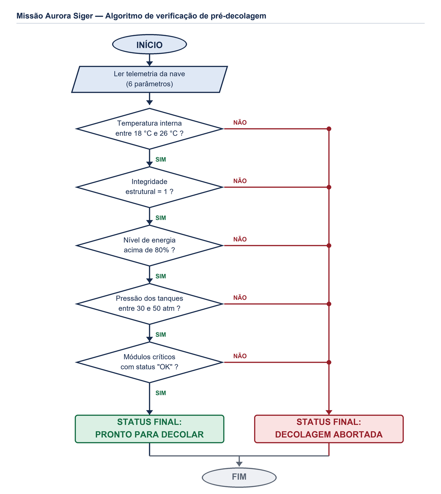
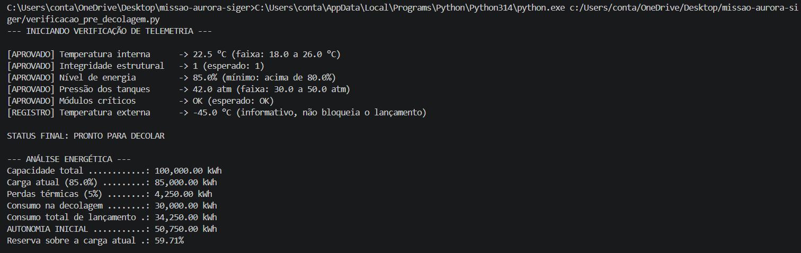

# Missão Aurora Siger — Verificação de Pré-Decolagem

Atividade integradora de análise de telemetria: um programa em Python que lê os dados enviados
pela nave **Aurora Siger**, compara cada leitura com as faixas seguras definidas para a missão e
decide entre **PRONTO PARA DECOLAR** e **DECOLAGEM ABORTADA**. Além da decisão, o programa
calcula a autonomia energética da nave para o período logo após o lançamento.

---

## Sobre o projeto

A nave envia seis leituras por ciclo. Cinco delas podem bloquear o lançamento e uma serve apenas
para registro em log:

| Parâmetro | Leitura atual | Faixa segura | Papel na decisão |
|---|---|---|---|
| Temperatura interna | 22,5 °C | 18 a 26 °C | Bloqueia o lançamento |
| Temperatura externa | -45,0 °C | — | Apenas registro |
| Integridade estrutural | 1 | igual a 1 | Bloqueia o lançamento |
| Nível de energia | 85,0 % | acima de 80 % | Bloqueia o lançamento |
| Pressão dos tanques | 42,0 atm | 30 a 50 atm | Bloqueia o lançamento |
| Status dos módulos críticos | OK | igual a "OK" | Bloqueia o lançamento |

A regra de decisão é conservadora de propósito: as cinco condições de bloqueio precisam ser
atendidas ao mesmo tempo. Basta uma falhar para abortar o lançamento — não há compensação entre
critérios, já que energia sobrando não cobre um casco comprometido.

### Fluxograma do algoritmo



### Análise energética

```
Carga atual        = 100.000 kWh × 85%          =  85.000 kWh
Perdas térmicas    =  85.000 kWh × 5%           =   4.250 kWh
Consumo total      =  30.000 kWh + 4.250 kWh    =  34.250 kWh
Autonomia inicial  =  85.000 kWh − 34.250 kWh   =  50.750 kWh
```

A nave chega à órbita com **50.750 kWh**, cerca de 59,7% da carga com que iniciou a contagem
regressiva.

---

## Estrutura do repositório

```
missao-aurora-siger/
├── missao_aurora_siger.ipynb        Notebook com todas as etapas da atividade
├── verificacao_pre_decolagem.py     Mesma lógica em script, para rodar no terminal
├── README.md
└── docs/
    ├── Relatorio_Operacional_Pre_Decolagem_Aurora_Siger.pdf
    ├── fluxograma_decisao.png
    └── prints/                      Capturas da execução
```

---

## Print da execução

Execução do script no terminal com a telemetria nominal da missão: as cinco verificações de
bloqueio aprovadas, o status final liberando o lançamento e o cálculo de autonomia energética.



O cenário de aborto, com a telemetria comprometida, está na última célula do notebook e no
relatório em PDF (seção 3.3).

---

## Como executar

### Requisitos

- Python 3.10 ou superior
- Nenhuma biblioteca externa — o projeto usa apenas a biblioteca padrão

### Opção 1 — rodar o script no terminal

```bash
git clone https://github.com/Joaomarcelloo-dev/missao-aurora-siger.git
cd missao-aurora-siger
python verificacao_pre_decolagem.py
```

Saída esperada:

```
--- INICIANDO VERIFICAÇÃO DE TELEMETRIA ---

[APROVADO] Temperatura interna      -> 22.5 °C (faixa: 18.0 a 26.0 °C)
[APROVADO] Integridade estrutural   -> 1 (esperado: 1)
[APROVADO] Nível de energia         -> 85.0% (mínimo: acima de 80.0%)
[APROVADO] Pressão dos tanques      -> 42.0 atm (faixa: 30.0 a 50.0 atm)
[APROVADO] Módulos críticos         -> OK (esperado: OK)
[REGISTRO] Temperatura externa      -> -45.0 °C (informativo, não bloqueia o lançamento)

STATUS FINAL: PRONTO PARA DECOLAR

--- ANÁLISE ENERGÉTICA ---
Capacidade total ............: 100,000.00 kWh
Carga atual (85.0%) .........: 85,000.00 kWh
Perdas térmicas (5%) ........: 4,250.00 kWh
Consumo na decolagem ........: 30,000.00 kWh
Consumo total de lançamento .: 34,250.00 kWh
AUTONOMIA INICIAL ...........: 50,750.00 kWh
Reserva sobre a carga atual .: 59.71%
```

### Opção 2 — abrir o notebook

```bash
pip install jupyter
jupyter notebook missao_aurora_siger.ipynb
```

Com o notebook aberto, execute as células na ordem com `Shift + Enter`, de cima para baixo.

O notebook também pode ser aberto direto no navegador, sem instalar nada: no
[Google Colab](https://colab.research.google.com), use **Arquivo → Abrir notebook → GitHub** e
cole o link deste repositório.

### Testando outros cenários

Para simular uma telemetria diferente, altere os valores do dicionário `telemetria` na primeira
célula de código do notebook (ou as variáveis no topo do script) e rode novamente. A última
célula já traz um cenário comprometido pronto, usado para confirmar que o caminho de aborto
funciona.

---

## Relatório completo

A análise assistida por IA (classificação dos dados, identificação de anomalias e avaliação de
risco) e a reflexão crítica sobre ética, impacto social e sustentabilidade tecnológica estão no
relatório em PDF, dentro da pasta `docs/`.
